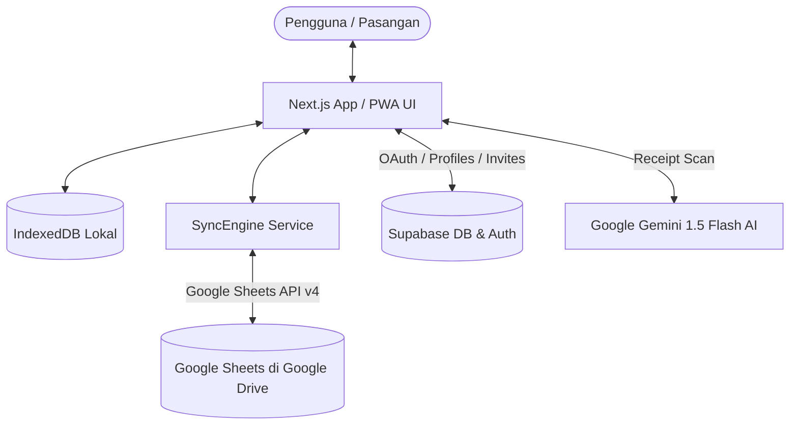

# FinLog: Panduan Arsitektur Sistem, Skema Data & Business Flow

Dokumen ini merupakan referensi teknis resmi dan komprehensif untuk aplikasi **FinLog** (Sistem Pencatatan Keuangan Pribadi & Pasangan Berbasis Google Sheets secara Real-Time dan Offline-First).

---

## 1. Ringkasan Visi & Arsitektur Hybrid

FinLog mengadopsi arsitektur **Hybrid Privacy-Centric**:
* **Google Sheets (Google Drive Pengguna):** Bertindak sebagai *Single Source of Truth* untuk seluruh data transaksi keuangan, anggaran, target tabungan, tagihan rutin, dan konfigurasi kategori. Data keuangan pengguna tidak pernah disimpan di server pihak ketiga.
* **Supabase (PostgreSQL + Auth + RLS):** Bertindak sebagai *Identity & Collaboration Layer* untuk autentikasi Google OAuth, manajemen profil pengguna, relasi pasangan (*Partner Pairing*), dan pengelolaan kode undangan (*Partner Invites*).
* **IndexedDB via Dexie.js (Client-Side Database):** Bertindak sebagai *Offline Cache & Local Store* yang memungkinkan pengoperasian instan tanpa latensi (*Optimistic UI*) dan pencatatan saat tanpa sinyal (*Offline-First*).
* **Google Gemini AI (`gemini-1.5-flash`):** Pemindai struk belanja otomatis (*Receipt OCR*) yang mengekstrak total belanja, tanggal, kategori, dan deskripsi secara cerdas.



---

## 2. Tech Stack

* **Frontend Framework:** Next.js 16+ (App Router, Turbopack, React 19)
* **Styling & Design System:** Tailwind CSS v4 + Vanilla CSS Variables (Tema Gelap, Terang, dan Sistem)
* **Icons:** Lucide React
* **Client Database:** Dexie.js v4 (IndexedDB Wrapper)
* **Backend & Auth:** Supabase Auth (Google OAuth Provider) + PostgreSQL dengan Row Level Security (RLS)
* **Google APIs:**
  * Google Sheets API v4
  * Google Drive API v3
* **AI Engine:** Google Generative AI (`gemini-1.5-flash-latest`)
* **Visual Effects:** Canvas Confetti

---

## 3. Alur Bisnis Utama (Business Flows)

### 3.1. Alur Autentikasi & Login Google OAuth
1. Pengguna membuka `/login` dan menekan **"Lanjut dengan Google"**.
2. Aplikasi mengarahkan pengguna ke Google OAuth via Supabase dengan izin (*scope*):
   * `https://www.googleapis.com/auth/spreadsheets`
   * `https://www.googleapis.com/auth/drive.file`
   * `email`, `profile`
   * `access_type: offline`, `prompt: consent` (untuk mendapatkan Refresh Token).
3. Setelah disetujui, Google mengalihkan ke `/auth/callback`.
4. Route handler `/auth/callback/route.ts` menukarkan *auth code* dengan sesi Supabase, menyimpan *provider refresh token* di database, dan mengarahkan pengguna ke:
   * `/` jika sudah menyelesaikan onboarding (`onboarding_completed: true` dan `spreadsheet_id` sudah ada).
   * `/onboarding` jika pengguna baru atau belum memiliki spreadsheet terhubung.

---

### 3.2. Alur Onboarding (Pembuatan Spreadsheet & Seeding Kategori)
Halaman `/onboarding` memiliki dua jalur:

#### Jalur A: Buat Sheet Baru (Wizard 4 Langkah)
1. **Langkah 1 (Nama Sheet):** Pengguna menentukan nama file spreadsheet (default: *FinLog*).
2. **Langkah 2 (Kategori Pengeluaran):** Pengguna memilih atau menambah kategori kustom dengan *Color Picker* (dilengkapi validasi anti-duplikat).
3. **Langkah 3 (Metode Pembayaran):** Pengguna memilih atau menambah metode bayar/dompet (BCA, GoPay, Cash, dll) beserta warna ikon.
4. **Langkah 4 (Sumber Pemasukan & Pengingat):** Pengguna mengatur sumber pemasukan dan menyetel waktu pengingat harian (menggunakan *Time Picker* dan *iOS Switch*).
5. **Eksekusi Pembuatan (`handleFinishNew`):**
   * Aplikasi membuat spreadsheet baru di Google Drive pengguna dengan 6 tab standar.
   * Menuliskan header kolom di setiap tab.
   * **Seeding Konfigurasi:** Langsung menuliskan seluruh daftar kategori pengeluaran, metode bayar, dan sumber pemasukan kustom ke dalam tab `Config` di Google Sheets.
   * Menyimpan data kategori ke `db.categories` lokal dan mengaktifkan spreadsheet di profil pengguna.
   * Mengarahkan pengguna langsung ke Dashboard `/`.

#### Jalur B: Gunakan Spreadsheet yang Sudah Ada (Instant Connect)
1. Pengguna memasukkan link atau ID Google Spreadsheet yang sudah ada.
2. Aplikasi membersihkan mock data lokal, mengaitkan ID spreadsheet tersebut ke profil Supabase dan IndexedDB, lalu langsung menarik (*pull sync*) seluruh data transaksi, anggaran, tabungan, dan kategori dari spreadsheet tersebut tanpa perlu melalui wizard.

---

### 3.3. Alur Kolaborasi Pasangan & Undangan (`/invite/[code]`)
1. **Pembuatan Undangan:**
   * Pengguna utama membuka halaman Pengaturan (`/settings`) atau modal Ajak Pasangan (`PartnerModal.tsx`).
   * Sistem memastikan `invite_code` unik (format `FIN-XXXX`) tersimpan di tabel `profiles` dan aktif di tabel `partner_invites`.
   * Link undangan yang dihasilkan: `https://domain.com/invite/FIN-XXXX`.
2. **Penerimaan Undangan:**
   * Pasangan membuka link `https://domain.com/invite/FIN-XXXX`.
   * Halaman `/invite/[code]` memvalidasi kode undangan ke Supabase dan menampilkan nama serta avatar pengundang.
   * **Jika pasangan belum login:** Menekan tombol "Gabung dengan Google", diarahkan ke OAuth dengan parameter `invite_code`, lalu otomatis ditautkan ke akun dan spreadsheet pengundang setelah login.
   * **Jika pasangan sudah login:** Menekan tombol "Terima Undangan", Supabase langsung memperbarui `partner_id` kedua belah pihak dan mengaitkan ID spreadsheet yang sama.
   * Menampilkan animasi selebrasi *confetti* dan mengarahkan pasangan ke dashboard bersama.

---

### 3.4. Alur Sinkronisasi Data (Offline-First Sync Engine)
Pengelolaan sinkronisasi ditangani secara otomatis oleh `SyncEngine` (`src/lib/google/sync.ts`):

1. **Pencatatan Optimis (Zero Latency):**
   * Setiap penambahan/perubahan transaksi, anggaran, tabungan, tagihan rutin, atau kategori langsung disimpan ke IndexedDB lokal (`db.transactions`, dll).
   * UI langsung ter-update seketika (*instant response*).
2. **Antrean Sinkronisasi (`db.sync_queue`):**
   * Setiap mutasi dicatat ke dalam antrean offline (`sync_queue`).
3. **Proses Pengiriman (*Drain Queue*):**
   * Jika online, `syncEngine.syncNow()` memproses antrean satu per satu ke Google Sheets API.
   * Setelah sukses masuk ke baris sheet, item dihapus dari antrean.
   * Jika koneksi terputus (*offline*), antrean tetap tersimpan aman di perangkat dan akan otomatis dikirim saat perangkat kembali online.
4. **Pembaruan Data Dua Arah (*Pull Sync*):**
   * Setiap interval 60 detik atau saat aplikasi dibuka, `SyncEngine` menarik data terbaru dari Google Sheets untuk menangkap catatan baru yang dibuat oleh pasangan.

---

### 3.5. Alur Pemutusan & Hubungkan Ulang Spreadsheet (Settings)
* **Hubungkan Ulang:** Menjalankan ulang alur OAuth untuk memperbarui token akses Google jika token kedaluwarsa atau izin dicabut.
* **Putuskan:** Menghapus asosiasi spreadsheet lokal dan di Supabase (`spreadsheet_id = null`). File spreadsheet fisik di Google Drive pengguna **tetap aman dan tidak terhapus**. Pengguna dialihkan ke `/onboarding` untuk memilih sheet baru atau sheet lain.
* **Keluar dari Akun (Logout):** Memanggil `supabase.auth.signOut()`, membersihkan IndexedDB lokal, menghapus token di storage, dan mengarahkan browser ke `/login`.

---

## 4. Skema Database

### 4.1. Skema Supabase (PostgreSQL)

```sql
-- Tabel Profil Pengguna
create table public.profiles (
  id uuid references auth.users on delete cascade primary key,
  email text,
  name text,
  avatar_url text,
  spreadsheet_id text,
  spreadsheet_name text default 'FINLOG',
  partner_id uuid references public.profiles(id) on delete set null,
  invite_code text unique,
  reminder_enabled boolean default true,
  reminder_time text default '20:00',
  onboarding_completed boolean default false,
  google_refresh_token text,
  created_at timestamp with time zone default timezone('utc'::text, now()) not null,
  updated_at timestamp with time zone default timezone('utc'::text, now()) not null
);

-- Tabel Undangan Pasangan
create table public.partner_invites (
  id uuid default gen_random_uuid() primary key,
  inviter_id uuid references public.profiles(id) on delete cascade not null,
  invite_code text unique not null,
  spreadsheet_id text not null,
  spreadsheet_name text default 'FINLOG',
  status text default 'active',
  created_at timestamp with time zone default timezone('utc'::text, now()) not null
);
```

#### Kebijakan Keamanan (Row Level Security - RLS)
* Non-recursive policy pada `profiles`:
  ```sql
  create policy "Allow authenticated users to read profiles"
    on public.profiles for select
    using (auth.uid() is not null);

  create policy "Allow users to update their own profile"
    on public.profiles for update
    using (auth.uid() = id);
  ```
* Policy pada `partner_invites`:
  ```sql
  create policy "Allow authenticated users to read active invites"
    on public.partner_invites for select
    using (auth.uid() is not null);
  ```

---

### 4.2. Skema Dexie.js (IndexedDB Lokal)

| Tabel | Primary Key | Indeks Pencarian | Deskripsi |
| :--- | :--- | :--- | :--- |
| `user_profile` | `id` | `id, email` | Profil pengguna lokal & preferensi |
| `transactions` | `id` | `id, date, type, category, paymentMethod` | Histori pemasukan & pengeluaran |
| `categories` | `id` | `id, type, name, order` | Master kategori & metode bayar |
| `budgets` | `id` | `id, month, category` | Target batas anggaran bulanan |
| `savings` | `id` | `id, name` | Target tabungan impian |
| `savings_logs`| `id` | `id, savingsId, date` | Riwayat setoran/tarikan tabungan |
| `recurring` | `id` | `id, isActive, frequency` | Tagihan otomatis & pengeluaran rutin |
| `sync_queue` | `++id` | `id, entity, action, timestamp` | Antrean mutasi offline |

---

### 4.3. Struktur Tab Google Sheets (6 Tab Standar)

1. **`Transactions` (Tab Transaksi):**
   `[ID, Tanggal, Tipe, Deskripsi, Kategori, Metode Pembayaran, Jumlah (IDR), Dicatat Oleh, Created At, Updated At]`
2. **`Budgets` (Tab Anggaran):**
   `[ID, Bulan, Kategori, Batas Anggaran (IDR)]`
3. **`Savings` (Tab Tabungan Target):**
   `[ID, Nama Target, Target Jumlah, Terkumpul, Tenggat Tanggal, Ikon, Warna]`
4. **`Savings_Logs` (Tab Histori Tabungan):**
   `[ID, Tanggal, Savings ID, Nama Target, Tempat Uang, Jumlah, Dicatat Oleh, Created At]`
5. **`Recurring` (Tab Tagihan Rutin):**
   `[ID, Nama Tagihan, Jumlah, Kategori, Metode Pembayaran, Frekuensi, Hari Eksekusi, Otomatis Catat, Terakhir Dicatat, Status Aktif]`
6. **`Config` (Tab Konfigurasi):**
   `[ID, Tipe, Nama, Warna, Ikon, Urutan]`

---

## 5. Checklist Verifikasi & Deployment Produksi (Vercel)

Saat melakukan deployment ke Vercel:
1. **Environment Variables yang Wajib Disetel:**
   * `NEXT_PUBLIC_SUPABASE_URL`: URL Project Supabase Anda (`https://xxx.supabase.co`)
   * `NEXT_PUBLIC_SUPABASE_ANON_KEY`: Supabase Publishable / Anon Key
   * `NEXT_PUBLIC_GOOGLE_CLIENT_ID`: Google OAuth Client ID
   * `GOOGLE_CLIENT_SECRET`: Google OAuth Client Secret
   * `NEXT_PUBLIC_GEMINI_API_KEY`: Google Gemini API Key untuk pemindai struk
2. **Google Cloud Console Settings:**
   * **Authorized JavaScript Origins:** Tambahkan `https://domain-anda.vercel.app` dan `http://localhost:3000`.
   * **Authorized Redirect URIs:** Tambahkan `https://<project-ref>.supabase.co/auth/v1/callback`.
3. **Supabase Auth URL Configuration:**
   * **Site URL:** `https://domain-anda.vercel.app`
   * **Redirect URLs:** Tambahkan `https://domain-anda.vercel.app/**` dan `http://localhost:3000/**`.

---
*Dokumentasi ini dibuat dan dipelihara secara berkala sebagai acuan pengembangan berkelanjutan FinLog.*
